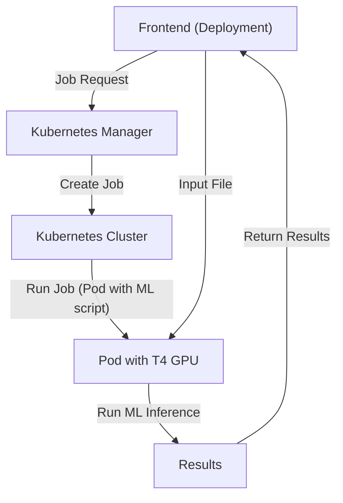

# Protein Engineering Server

Use cases:
1. Input a protein, and get a probability distribution of amino acids at each position (masked prediction).
1a. Following from this, predict most likely variant
2. Input a protein, and get the latent representation of it (representation).
3. Visualize protein, and labeled variant.

Deployment:

1. Frontend: Kubernetes Deployment
2. Backend (Kubernetes Manager): Google Cloud Functions
3. ML Inference: Kubernetes Job
4. File communication: Google Cloud Buckets

### Progress
Structure
- [x] Architecture Diagram

Frontend
- [x] frontend input
- [] Add File icon to input box once FASTA file has been inputted
- [] mock output for frontend
- [] probability distribution viz, protein 3d viz for frontend
- [] create new bucket with input files
- [] call Kubernetes Job Manager, include link to new bucket for application I/O
- [] upload preference inference data to viz

Inference
- [x] test running ESMFold on GCP instance
- [x] test running ESMFold with GPUs on GCP instance
- [x] ~~ESM optimization using sharding~~ not worth it, running into issues loading the sharded model. I think the model is already sharded from HF since it's 15GB
- [x] packaging ESM into a dockerfile
- [] loading ESM dockerfile on GKE with reserved instances
- [] saving files from ESM GKE
- [] communicating files to frontend from GKE backend
- [] ? emailing users of results

- [] ESM masked probability task on jupyter notebook
- [] add ESM masked probability to Docker image

Backend (Kubernetes Job Manager)
- [] read up on python kubernetes
- [] spin up test Kubernetes job manager